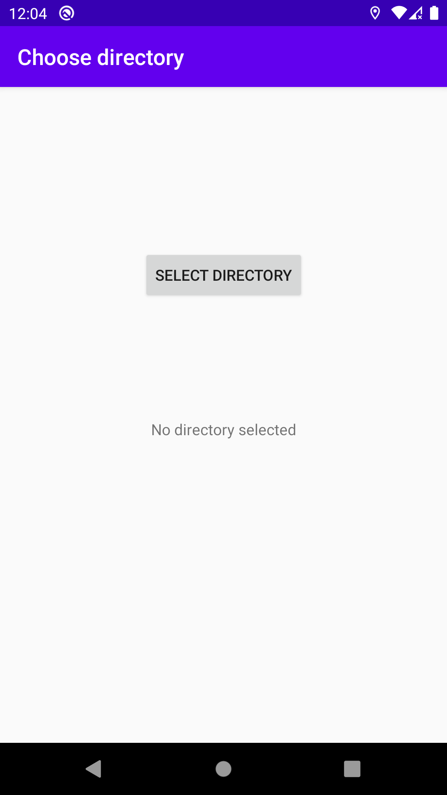
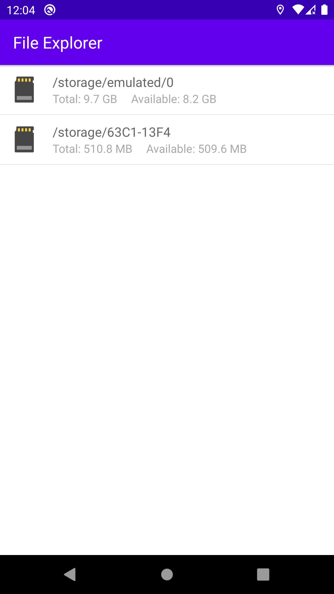
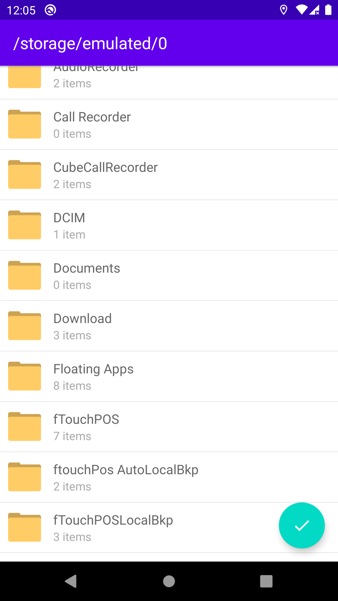
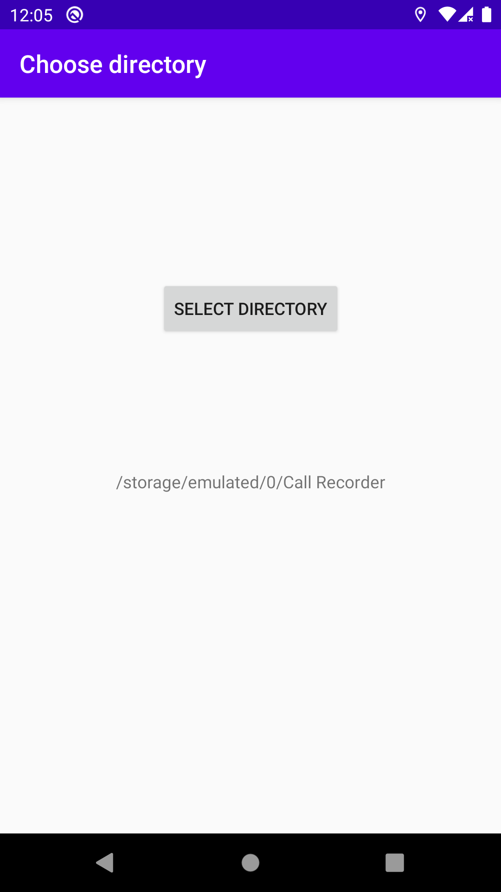

# Choose-directory-in-android
Choose directory or folder path in Android.

This Repository show's you that how to get path of directory or folder from Internal or External storage in android.

## Screenshots:-

 
 
